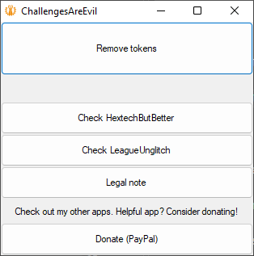

# ChallengesAreEvil

Remove your challenge tokens from profile banner with 1-click-button solution.

## App preview:

## Download

[Grab latest release here.](https://github.com/MaciejGorczyca/ChallengesAreEvil/releases/latest)

## Description

ChallengesAreEvil. ChallengesAreEvil. ChallengesAreEvil. ChallengesAreEvil. ChallengesAreEvil. ChallengesAreEvil. ChallengesAreEvil. ChallengesAreEvil. ChallengesAreEvil. ChallengesAreEvil. ChallengesAreEvil. ChallengesAreEvil. ChallengesAreEvil. ChallengesAreEvil. ChallengesAreEvil.

...no, seriously. "Don't die on ARAM" challenge? That's called griefing, Riot.

## Functionality

- Remove your challenge tokens from profile banner.

*Note: when you remove tokens with identity customization window open (icons, tokens, titles) then closing that window will overwrite tokens and set them back to what they were before.*

**WARNING!** The app can only reset tokens. It does not break anything and can't be bugged - it will either work or it won't. If something doesn't work after clearing tokens then it is because Riot made the client work that way. Apparently you need to select tokens in order. You can't select middle token only. You have to select left then middle then right. The app has nothing to do with this and it is Riot decision to make it work that way.

## Will I get banned? Is it legit?

The answer is most likely (99.99%) you won't get banned. The app uses built-in functionality of the client. It does not modify anything in the client. It interacts with the client telling it to do stuff and the client does everything itself. As of 2022-10-18 there were no reports of anyone getting banned.

## Author
 - Maciej Gorczyca
 - maciej.dariusz.gorczyca@gmail.com
 
## Donation
 The software is open source and provided to you for free. If you like it consider sending a donation: https://www.paypal.me/CoUsTme/1EUR
